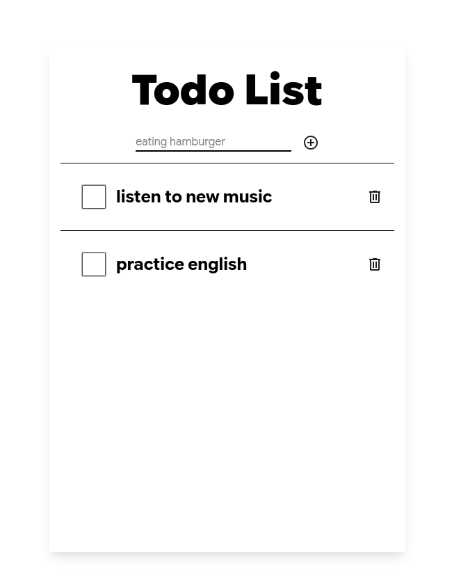

## Hello, world
This is my first project on Next.js, so I made a simple todo list that uses the POSTGRESQL database.

## Getting Started

First, run the development server:

```bash
npm run dev
# or
yarn dev
# or
pnpm dev
# or
bun dev
```

Open [http://localhost:3000](http://localhost:3000) with your browser to see the result.

## Admin Page
In this page, you can create/delete the database tables for the project it expects you to have a postgresql database running on background. The database URL must be written in the **.env** file in the **root** directory of the project as
#### POSTGRES_URL=postgresql://[user[:password]@][host][:port][/dbname][?param1=value1&param2=value2]

## Todo list:


